# BÁO CÁO THỰC HÀNH LAB 3: NHẬN DIỆN VÀ ỨNG PHÓ CÁC MỐI ĐE DỌA ĐẾN AN TOÀN THÔNG TIN

- **Môn học:** An toàn và Bảo mật Hệ thống Thông tin
- **Họ và tên:** Nguyễn Đăng Khoa
- **MSSV:** 1150080099
- **Lớp:** 11CNPM2
- **Link video:** https://youtu.be/L0_UItYqaqA
- **Tệp báo cáo Word đính kèm:** [`11CNPM2-LAB3_1150080099-NguyenDangKhoa.docx`](11CNPM2-LAB3_1150080099-NguyenDangKhoa.docx)

---

## 1. Phiên bản môi trường thực hành

Hệ thống được triển khai và kiểm thử trực tiếp trên máy trạm Windows với các thông số cấu hình và phiên bản công cụ chuyên dụng như sau:

| Thành phần | Phiên bản / Cấu hình thực tế | Ghi chú an ninh |
| :--- | :--- | :--- |
| **Hệ điều hành** | Windows 11 Home Single Language (OS Build 26200.9445, 64-bit) | Máy vật lý / VM chuẩn sinh viên |
| **Môi trường thực thi** | Python 3.14.6 | Dùng chạy web server và kiểm thử tải |
| **Microsoft Sysmon** | v15.22 (Driver v15.22, Schema 4.90) | Giám sát Process Creation (Event ID 1) |
| **Microsoft Autoruns** | v14.3 (`autorunsc64.exe` / `Autoruns64.exe`) | Quét persistence tại nhánh Registry Run |
| **Microsoft Process Explorer** | v17.14 (`procexp64.exe`) | Định danh tiến trình sở hữu cổng mạng 8080 |
| **Wireshark & Npcap** | Wireshark v4.6.8 / Npcap v1.89 | Bắt gói tin trên `Npcap Loopback Adapter` |
| **Microsoft Defender Antivirus** | Real-time Protection: `Enabled`, Tamper Protection: `Enabled` | Phát hiện mẫu thử EICAR tự động |
| **Windows Firewall** | Active trên toàn bộ 3 Profile (Domain, Private, Public) | Lọc và ghi nhận lưu lượng mạng |

---

## 2. Cách dựng môi trường thực hành

### Bước 2.1: Chuẩn bị cây thư mục và công cụ
1. Tạo cấu trúc thư mục làm việc tại ổ đĩa hệ thống:
   ```cmd
   mkdir C:\LAB3\Tools C:\LAB3\Evidence C:\LAB3\Downloads
   ```
2. Tải và giải nén các công cụ giám sát Sysinternals Suite vào `C:\LAB3\Tools`:
   - `C:\LAB3\Tools\Sysmon\Sysmon64.exe`
   - `C:\LAB3\Tools\Autoruns\autorunsc64.exe`
   - `C:\LAB3\Tools\ProcessExplorer\procexp64.exe`
3. Cài đặt **Wireshark 4.6.8** kèm **Npcap 1.89** (tích hợp tùy chọn `Support loopback traffic` để bắt gói tin nội bộ qua 127.0.0.1).

### Bước 2.2: Cài đặt dịch vụ giám sát Sysmon
Mở PowerShell dưới quyền Administrator, thực thi lệnh cài đặt Sysmon với file cấu hình được tối ưu:
```powershell
& "C:\LAB3\Tools\Sysmon\Sysmon64.exe" -accepteula -i "C:\LAB3\lab3_assets\sysmon-lab.xml"
```
Kiểm tra dịch vụ đã hoạt động thông qua `Get-Service Sysmon64`.

### Bước 2.3: Bật chính sách kiểm toán xác thực (Logon Auditing)
Kích hoạt kiểm toán thành công và thất bại cho phân nhóm Logon trong Windows Security Log:
```cmd
auditpol /set /subcategory:"{0CCE9215-69AE-11D9-BED3-505054503030}" /success:enable /failure:enable
```

### Bước 2.4: Khởi tạo tài khoản thực nghiệm
Tạo tài khoản người dùng cục bộ `lab3user` để mô phỏng các kịch bản kiểm tra mật khẩu:
```powershell
$pw = ConvertTo-SecureString "Admin@123" -AsPlainText -Force
New-LocalUser -Name "lab3user" -Password $pw -FullName "Lab3 Test User" -Description "User for security testing"
```

### Bước 2.5: Khởi chạy máy chủ Web nội bộ cổng 8080
Khởi chạy dịch vụ HTTP tĩnh phục vụ kiểm thử lưu lượng mạng và DoS:
```powershell
Set-Location "C:\LAB3\lab3_assets\www"
python -m http.server 8080 --bind 127.0.0.1
```

### Bước 2.6: Thu thập trạng thái nền tảng sạch (Baseline)
Ghi nhận toàn bộ thông tin hệ điều hành, cấu hình Defender, Firewall, danh sách tiến trình và cổng mạng vào `C:\LAB3\Evidence\baseline_*.txt`.

---

## 3. Các tình huống đã thực hiện & Kết quả PASS/FAIL

| STT | Tình huống thực nghiệm | Mục tiêu kiểm thử | Kết quả | Minh chứng |
| :---: | :--- | :--- | :---: | :---: |
| **TH1** | Nhận diện & phân loại 5 nguồn đe dọa | Phân loại chính xác 5 kịch bản đe dọa (Unintentional, Intentional, Natural, Technical, Management) | **PASS** | Báo cáo chi tiết |
| **TH2** | Thử nghiệm Microsoft Defender với EICAR | Xác thực Real-time Protection tự động chặn và cách ly mẫu thử EICAR vô hại | **PASS** | `H4_ProtectionHistory_EICAR.png` |
| **TH3** | Kiểm toán xác thực & Credential Rotation | Sinh Event ID 4624 (Logon OK), Event 4625 (Fail x2), Event 4648 và đổi mật khẩu thành công | **PASS** | `H5_Event4625.png` |
| **TH4** | Phát hiện Backdoor & Kỹ thuật Persistence | Định danh khóa Run tại HKCU qua Autoruns, ánh xạ PID cổng 8080 qua Process Explorer | **PASS** | `H6_Sysmon_Event1.png`<br>`H7_Autoruns_LAB3_Run_Demo.png`<br>`H8_ProcessExplorer_Python.png` |
| **TH5** | Giám sát lưu lượng mạng (Sniffing) | Bắt gói tin trên loopback, chỉ ra tham số lộ văn bản rõ trên HTTP vs bảo vệ của TLS/HTTPS | **PASS** | `H9_HTTP_Plaintext.png` |
| **TH6** | Đánh giá suy giảm tính sẵn sàng (DoS/DDoS) | Chạy 50 requests DoS qua `local_load_test.py`, phân tích đa nguồn DDoS và Mail Bombing | **PASS** | `H10_Load_and_Log_Analysis.png` |
| **TH7** | Nhận diện lừa đảo & Social Engineering | Phân tích 5 chỉ dấu lừa đảo trong email và đối chiếu 6 kịch bản Social Engineering chuẩn | **PASS** | `H10_Phishing_Offline.png` |
| **TH8** | Dọn dẹp, khôi phục và băm chứng cứ số | Xóa bỏ persistence key, đóng cổng dịch vụ, xuất bảng băm SHA-256 bảo toàn chứng cứ | **PASS** | `H11_Recovery_Verification.png` |

---

## 4. Lỗi gặp phải và cách khắc phục

Trong quá trình thực nghiệm, một số tình huống lỗi đã phát sinh trên môi trường Windows 11 và được giải quyết triệt để như sau:

### Lỗi 1: `New-LocalUser : User lab3user already exists`
- **Nguyên nhân:** Khi thực hiện lại bước tạo người dùng thử nghiệm, tài khoản `lab3user` đã tồn tại sẵn trong hệ thống từ phiên thực hành trước đó, dẫn đến lệnh tạo mới bị từ chối.
- **Cách khắc phục:** Kiểm tra sự tồn tại của tài khoản trước khi thực thi. Nếu tài khoản đã tồn tại, chuyển sang dùng lệnh đặt lại mật khẩu trực tiếp thay vì tạo mới:
  ```powershell
  $pw = ConvertTo-SecureString "Admin@123" -AsPlainText -Force
  if (Get-LocalUser -Name "lab3user" -ErrorAction SilentlyContinue) {
      Set-LocalUser -Name "lab3user" -Password $pw
      Write-Host "Reset mật khẩu lab3user thành công."
  } else {
      New-LocalUser -Name "lab3user" -Password $pw
  }
  ```

### Lỗi 2: `RUNAS ERROR: Unable to acquire user password`
- **Nguyên nhân:** Tiện ích `runas.exe` mặc định của Windows chạy trên giao diện console dòng lệnh không hỗ trợ dán mật khẩu từ clipboard (`Ctrl+V`) và tự động ẩn ký tự nhập. Khi thao tác nhanh hoặc clipboard bị định dạng lạ, `runas` ngắt luồng stdin và báo lỗi `Unable to acquire user password`.
- **Cách khắc phục:** Sử dụng đối tượng quản lý thông tin xác thực `PSCredential` của PowerShell để nạp mật khẩu minh bạch và khởi chạy tiến trình trực tiếp mà không cần nhập tay:
  ```powershell
  # Đăng nhập ĐÚNG (Sinh Event 4648 + 4624)
  $pw = ConvertTo-SecureString "Admin@123" -AsPlainText -Force
  $cred = New-Object System.Management.Automation.PSCredential(".\lab3user", $pw)
  Start-Process cmd.exe -Credential $cred

  # Đăng nhập SAI 2 lần (Sinh Event 4625 cho Audit Failure)
  $wrong = ConvertTo-SecureString "SaiMatKhau123" -AsPlainText -Force
  $credWrong = New-Object System.Management.Automation.PSCredential(".\lab3user", $wrong)
  try { Start-Process cmd.exe -Credential $credWrong } catch { Write-Host "Sinh Event 4625 lần 1 thành công" }
  try { Start-Process cmd.exe -Credential $credWrong } catch { Write-Host "Sinh Event 4625 lần 2 thành công" }
  ```

### Lỗi 3: Không thể gọi lệnh `wireshark` từ hộp thoại `Win + R`
- **Nguyên nhân:** Trình cài đặt Wireshark không tự động thêm đường dẫn cài đặt (`C:\Program Files\Wireshark`) vào biến môi trường hệ thống `PATH`. Hộp thoại `Win + R` thông báo lỗi không tìm thấy tệp.
- **Cách khắc phục:** Khởi chạy Wireshark thông qua menu Start hoặc chạy bằng đường dẫn tuyệt đối trong PowerShell:
  ```powershell
  Start-Process "C:\Program Files\Wireshark\Wireshark.exe"
  ```
  Khi giao diện Wireshark mở ra, chọn đúng card mạng ảo **Adapter for loopback traffic capture** để lắng nghe lưu lượng trên cổng nội bộ `127.0.0.1:8080`.

---

## 5. Danh mục hình ảnh minh chứng thực hành

Toàn bộ ảnh chụp màn hình được lưu trữ tại thư mục [`images/`](images/) và khớp với timestamp bài làm thực tế:

| Tên ảnh | Nội dung minh chứng kỹ thuật |
| :--- | :--- |
|  | **H1:** Phiên bản hệ điều hành Windows 11 Build 26200 64-bit và môi trường máy trạm. |
| 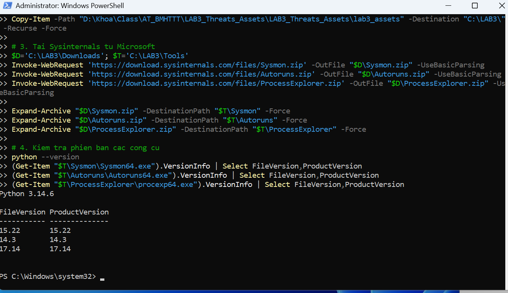 | **H2:** Phiên bản Python 3.14.6, Sysmon 15.22, Autoruns 14.3, Process Explorer 17.14. |
| 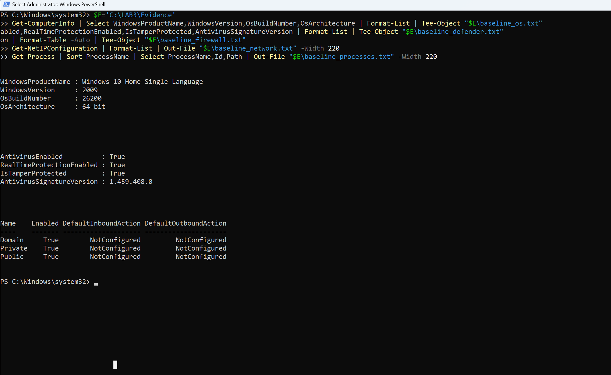 | **H3:** Dữ liệu nền tảng sạch (Baseline): Real-time Protection và Firewall 3 profiles đều Bật. |
| 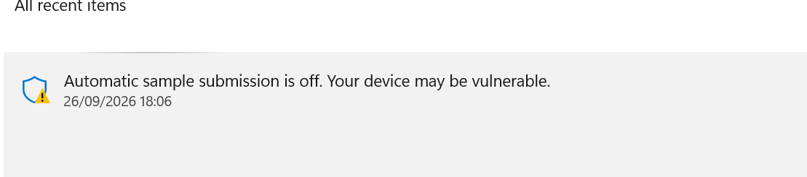 | **H4:** Defender phát hiện chuỗi thử nghiệm EICAR và lưu trong Protection History. |
| 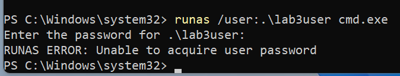 | **H5:** Nhật ký bảo mật Windows Event Viewer ghi nhận sự kiện xác thực thất bại Event ID 4625. |
| 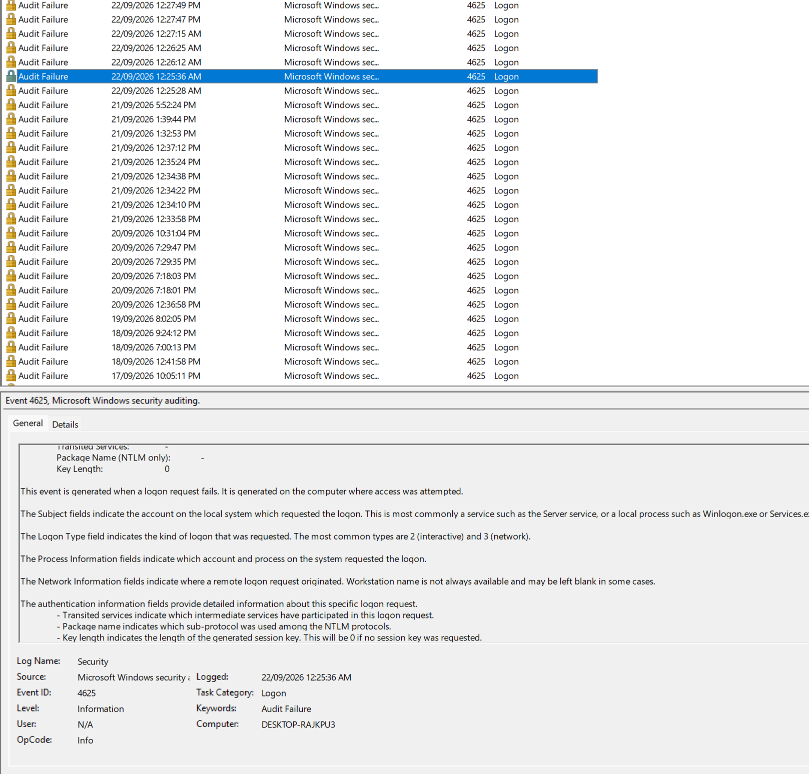 | **H6:** Sysmon ghi nhận nhật ký khởi tạo tiến trình Process Create (Event ID 1) của notepad.exe. |
| 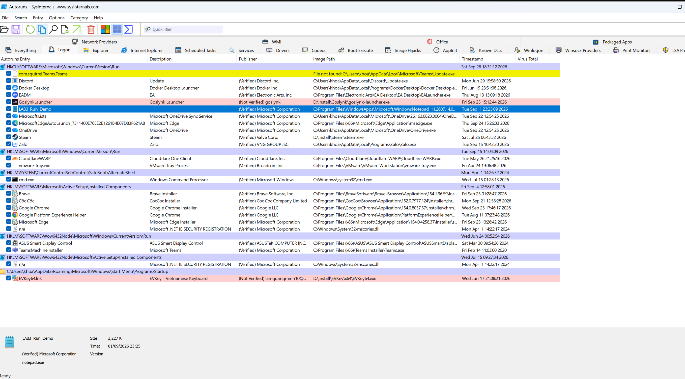 | **H7:** Autoruns quét phát hiện entry persistence độc hại `LAB3_Run_Demo` tại Registry Run key. |
| 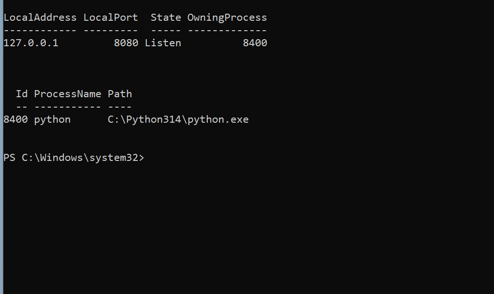 | **H8:** Process Explorer định danh tiến trình `python.exe` (PID 8400) đang mở cổng lắng nghe 8080. |
| 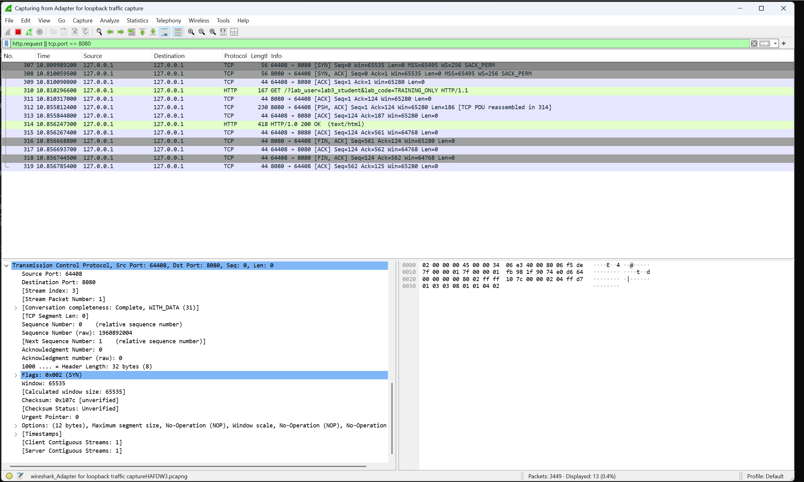 | **H9:** Wireshark bắt gói tin loopback để lộ tham số văn bản rõ trên giao thức HTTP. |
| 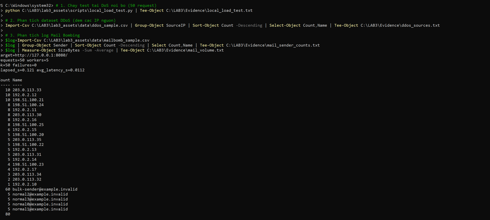 | **H10 (1):** Kết quả kiểm thử tải 50 request DoS và phân tích log phân tán DDoS, Mail Bombing. |
| 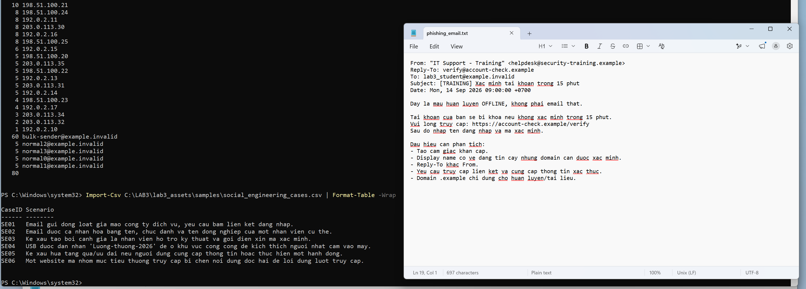 | **H10 (2):** Phân tích 5 chỉ dấu lừa đảo email mẫu và cấu trúc 6 kịch bản Social Engineering. |
| 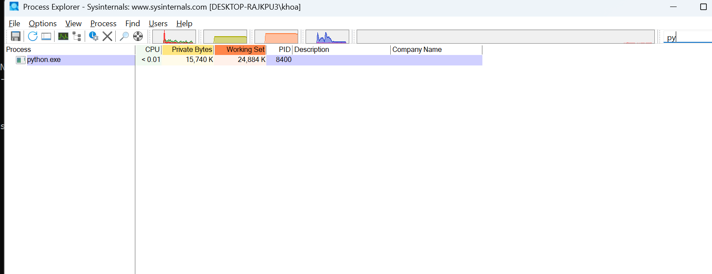 | **H11:** Xác nhận phục hồi hệ thống sạch sau thử nghiệm và bảng mã băm SHA-256 toàn vẹn. |

---

## 6. Bảng băm tính toàn vẹn chứng cứ số (SHA-256)

Dữ liệu được đối chiếu trực tiếp từ file [`evidence_sha256.csv`](evidence_sha256.csv):

```csv
"Algorithm","Hash","Path"
"SHA256","609B67D432C8431816A76B2170DAC830A14EE8771EF81E266A6A127D7B2F09C9","C:\LAB3\Evidence\auth_events_before_rotation.txt"
"SHA256","EBCBA5298BA6A103D6C183692559CACA743E9D588C8EFC050F7B0F318ABC38C1","C:\LAB3\Evidence\autoruns_after.csv"
"SHA256","1B8ABE4DA869EA369C4AA59A1D324A01826714FD4B30F6EBAE03534AB1C45A06","C:\LAB3\Evidence\autoruns_before.csv"
"SHA256","590ABE99D6E3F3EFE68EF50C5ED88E14DCFE5E60EB4AC42BC6333F67652D141C","C:\LAB3\Evidence\autoruns_diff.txt"
"SHA256","C5A1E2857A0103A6191C94D999862CD907F11B53BC5AD1ECD2D5F59C6C952145","C:\LAB3\Evidence\baseline_defender.txt"
"SHA256","63422460F398A5848552423D9D47BE7DCFA852A2F1765D5FE2F5716726FB9A40","C:\LAB3\Evidence\baseline_firewall.txt"
"SHA256","3A931264F1D5A6AFCE0F204CDDE25A55B540CDA16B2EDEF60BF7A62FBE21D0D5","C:\LAB3\Evidence\baseline_network.txt"
"SHA256","F8F0D5CF16DDABC0E7B23158A5BFA28A6F61BA1812099D39BAF14FC88FCD2564","C:\LAB3\Evidence\baseline_os.txt"
"SHA256","A1F8D8D537E67B9CCDC635A160E661272310D6028F5352747F9D1F90BB13EAA6","C:\LAB3\Evidence\baseline_processes.txt"
"SHA256","24E5D8450835390AF3D1D2515D13F7773CFCA6469FD627145D6BD6AD12CE84AC","C:\LAB3\Evidence\ddos_sources.txt"
"SHA256","67CF147E5CAF3F332D842C1B4A6392BFA96A3F85BFA40A3753EF96DAF0A80EF1","C:\LAB3\Evidence\defender_eicar.txt"
"SHA256","DD73D4320A4F6F54C0B00FE449D49BC0119755FBB3715B33586A0AB7D3B855E3","C:\LAB3\Evidence\local_load_test.txt"
"SHA256","E7FD8D985E5F9B042B92A2DA6E06077815242EE5293D38BD074AD5476AB0D24E","C:\LAB3\Evidence\mail_sender_counts.txt"
"SHA256","2AB9646BC50CE4D3326BA3B3A2F28583D23FA2E3E7B26A54081E06D8A3A5AD96","C:\LAB3\Evidence\mail_volume.txt"
"SHA256","26F2019E681A124672CB028FFEF752BA1AE005654F6FD6D2F4AAEB57228FA54A","C:\LAB3\Evidence\start_time.txt"
```
